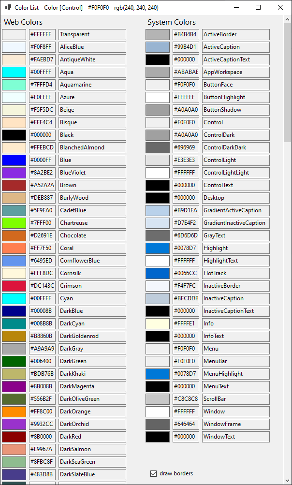

# Color List

It's just a tool written to create the predefined colors in `omw::colors`. The tool also creates a CSV file with the Windows system colors: [windowsSystemColors.csv](./windowsSystemColors.csv)

> Yeah, I know, .NET😒 But it was the simplest/fastest way I knew to get this. 🤔 Why does [GetSysColor](https://docs.microsoft.com/en-us/windows/win32/api/winuser/nf-winuser-getsyscolor) not work in normal themes?

## GUI
Then the GUI elements were added. With a click to a color, the background changes to that same color.

